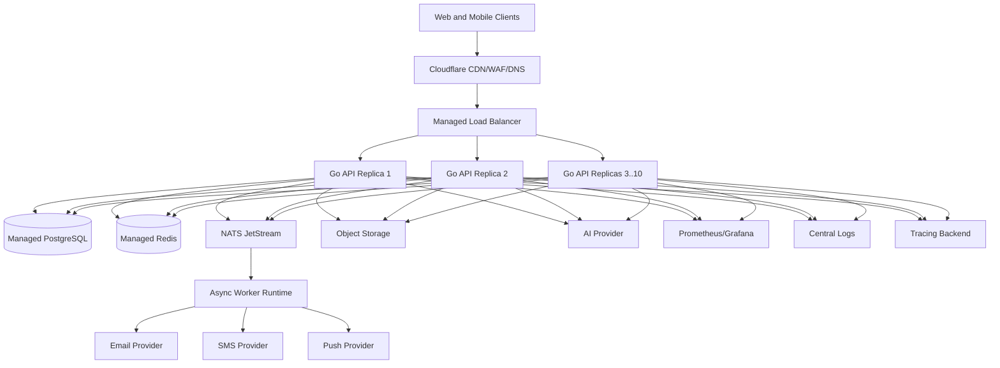
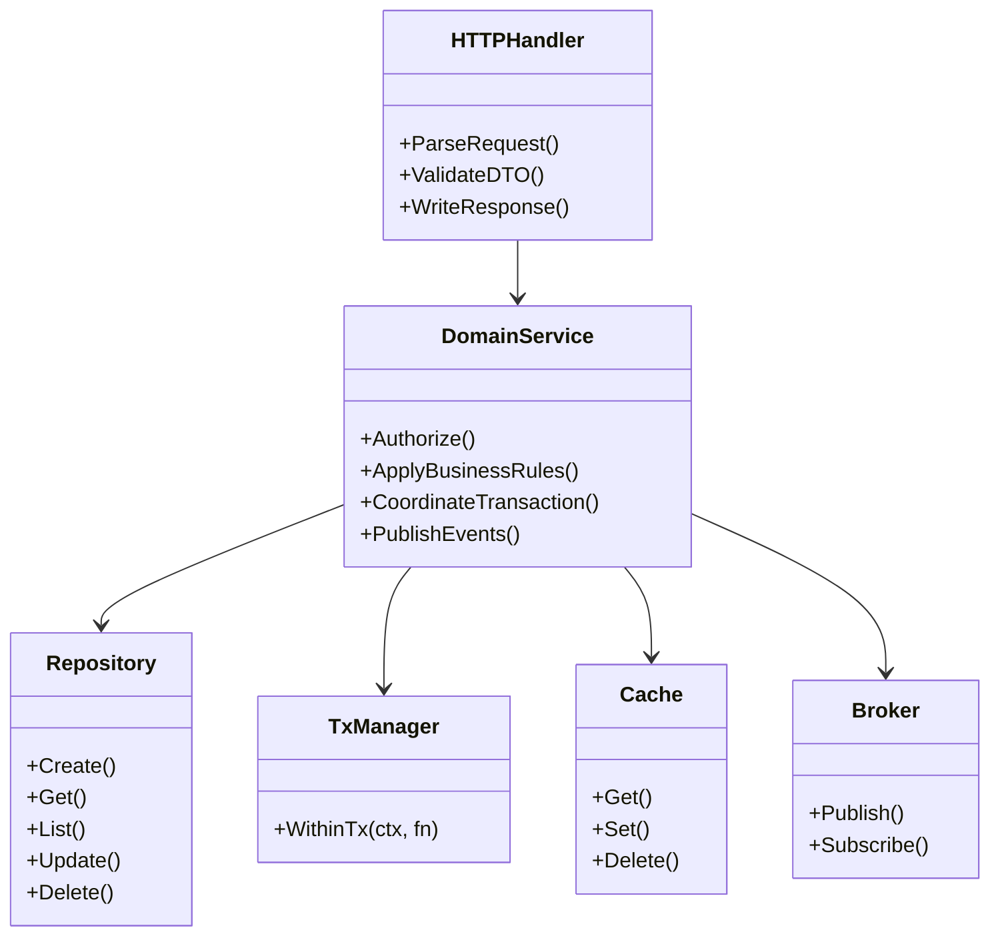
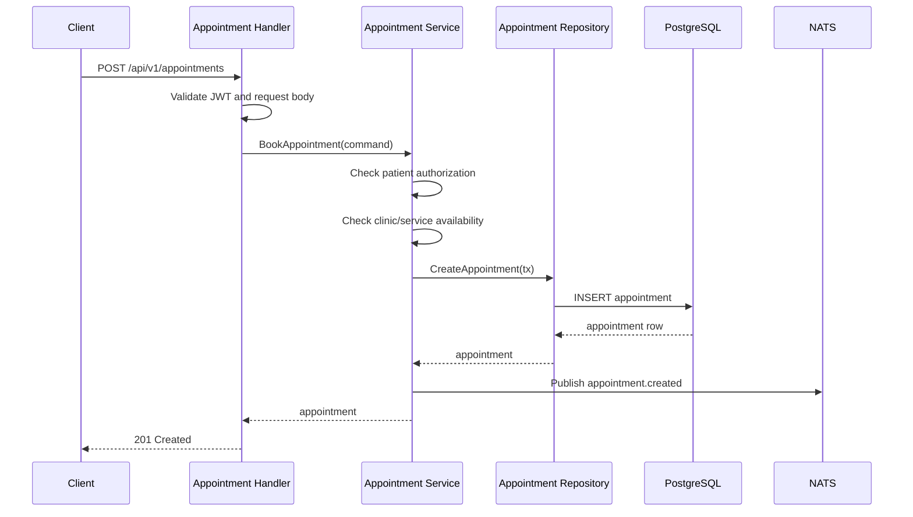
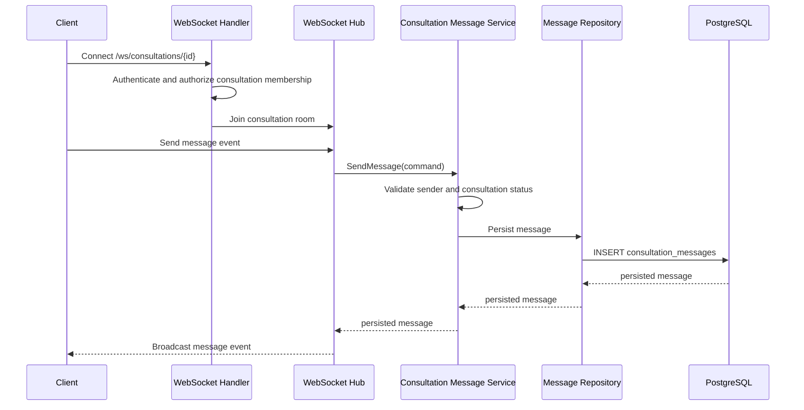

# Healthcare Access Connector Target Production System Design

Date: 2026-04-28
Status: Proposed target production design
Architecture choice: Production modular monolith

## 1. Executive Summary

Healthcare Access Connector is a healthcare access backend that connects patients, caregivers, clinics, healthcare workers, system administrators, and NGO partners. The production target is a modular Go monolith with clear internal domain boundaries, a managed PostgreSQL system of record, Redis for low-latency ephemeral state, NATS for asynchronous workflows, WebSocket support for telemedicine chat, and managed providers for email, SMS, object storage, monitoring, and deployment.

The system deliberately remains a single deployable backend at this stage. This reduces operational complexity while still enforcing strong boundaries through packages, interfaces, transactions, event contracts, and domain-specific services. If load or team structure later requires extraction, the best first candidates are notifications, telemedicine realtime, and analytics/reporting.

## 2. Requirements and Scope

### 2.1 Functional Requirements

Core identity and access:

- Register users through email and/or phone.
- Support patient, provider staff, clinic admin, system admin, and NGO partner roles.
- Authenticate with password, JWT access tokens, refresh/session management, and optional OTP flows.
- Verify email/phone ownership.
- Track active sessions, device metadata, revocation, and login history.
- Enforce role-based and clinic-scoped authorization.

Patient and caregiver management:

- Manage patient profiles, demographic details, language preferences, communication preferences, and location.
- Manage medical summary data, allergies, medications, conditions, surgeries, immunizations, family history, emergency contacts, dependents, and dependent health records.
- Track consent for health data processing, emergency access, SMS/email communication, research, and data sharing.
- Record sensitive data access for compliance and audit.

Provider and clinic management:

- Register clinics and provider staff.
- Manage clinic details, location, services, credentials, staff invitations, and verification state.
- Support clinic admins inviting, accepting, declining, and managing staff.
- Track provider availability for appointments and telemedicine.

Appointments:

- Allow patients to request appointments with clinics.
- Allow clinic staff to confirm, cancel, complete, or mark no-shows.
- Store appointment metadata, patient contact snapshot, reminders, and cancellation/confirmation audit metadata.
- Support reminder workflows through asynchronous messaging.

Telemedicine:

- Run symptom checker sessions and record AI-assisted triage output.
- Convert eligible symptom sessions into consultations.
- Track consultation lifecycle: pending acceptance, accepted, in progress, completed, cancelled, escalated, declined, or no-show.
- Support realtime consultation chat over WebSockets and HTTP polling fallback.
- Persist consultation messages, read state, attachments metadata, clinical notes, and follow-up references.
- Track provider availability, heartbeat, current consultation load, and estimated wait time.

Notifications and communications:

- Send email notifications for verification, password reset, welcome, login alerts, invitations, appointment updates, and telemedicine events.
- Send SMS notifications and SMS menu interactions where enabled.
- Store notification preferences and respect quiet hours/channel opt-outs.
- Route notification work asynchronously where possible.

Administration and operations:

- Allow system admins to manage users, statuses, roles, clinics, verification, and privileged reports.
- Allow NGO partners to access configured reporting slices without direct broad access to PHI.
- Expose health, readiness, liveness, and Prometheus metrics endpoints.
- Support operational audit logs, incident investigation, and data retention workflows.

Out of scope for this target design:

- Full microservice decomposition.
- Formal HIPAA, SOC 2, or ISO 27001 certification completion.
- Direct insurer adjudication and claims processing.
- Native mobile frontend design.
- Clinical diagnosis automation. AI output is triage assistance only and must be labeled and handled as decision support.

### 2.2 Non-Functional Requirements

Availability:

- API monthly availability target: 99.9%.
- Managed PostgreSQL with high availability and point-in-time recovery.
- At least two API replicas in production.
- Rolling deployments with readiness checks.

Latency:

- p50 API latency: below 100 ms for simple reads.
- p95 API latency: below 300 ms for common authenticated CRUD operations.
- p99 API latency: below 500 ms under expected peak load.
- WebSocket message persistence-to-broadcast target: below 250 ms p95 inside one region.

Scalability:

- Baseline: 500 concurrent users, 100 requests per second, 50 WebSocket connections.
- Peak target: 5,000 concurrent users, 1,000 requests per second, 500 WebSocket connections.
- API horizontally scales from 2 to 10 replicas.
- Database uses connection pooling, query indexes, read replicas for reporting, and partitioning for large audit/event tables when needed.

Security and privacy:

- TLS required for all production external traffic and database connections.
- Encryption at rest for PostgreSQL, Redis where supported, object storage, logs, and backups.
- Passwords hashed with bcrypt.
- JWTs signed with strong rotating secrets or asymmetric keys in a future hardening phase.
- Strict role-based access control and service-layer ownership checks.
- PHI must not be logged in plain text.
- POPIA-ready consent, access logging, deletion/export workflows, and retention policies.
- HIPAA-ready technical controls, pending formal organizational and third-party audit requirements.

Consistency:

- PostgreSQL is the source of truth.
- Strong consistency is required for identity, consent, access control, appointments, consultation lifecycle, clinical notes, and audit records.
- Eventual consistency is acceptable for notifications, reminder delivery, cache invalidation, analytics, and reporting aggregates.

Maintainability:

- Keep one deployable backend, but maintain domain isolation through handler, service, repository, domain, DTO, and infrastructure packages.
- Domain services own business rules.
- Repositories own SQL and persistence mapping.
- Handlers own HTTP/WebSocket transport concerns only.
- Cross-cutting concerns live in middleware or infrastructure packages.

### 2.3 Capacity Estimation

Initial production assumptions:

| Metric | Baseline | Peak |
|---|---:|---:|
| Registered users | 50,000 | 500,000 |
| Monthly active users | 10,000 | 100,000 |
| Concurrent users | 500 | 5,000 |
| API requests per second | 100 | 1,000 |
| WebSocket connections | 50 | 500 |
| Daily appointments | 500 | 10,000 |
| Daily telemedicine consultations | 100 | 5,000 |
| Daily notification events | 5,000 | 250,000 |
| PostgreSQL storage | 10 GB initial | 100 GB in 12 months |
| Redis memory | 256 MB initial | 1 GB in 12 months |

Rough storage model:

- Users and profiles: small structured rows, hundreds of MB at 500,000 users.
- Medical records: several KB per patient per record category, tens of GB at scale.
- Consultation messages: dominant growth path for chat; partition or archive by `sent_at` once tables reach tens of millions of rows.
- Audit and access logs: high write volume; partition by month and retain according to policy.
- Attachments: store outside PostgreSQL in object storage; keep only metadata and signed URLs in the database.

## 3. Data Modeling

### 3.1 Database Choice

Use PostgreSQL as the primary database because the system has relational entities, strong integrity requirements, transactions, ad hoc reporting needs, and compliance-sensitive audit trails. PostgreSQL also supports JSONB for flexible fields such as consent metadata, clinic services, operating hours, symptom answers, reminder preferences, and event metadata.

Use Redis for ephemeral and performance-oriented data:

- Rate limiting counters.
- Short-lived OTP/session/cache entries.
- Hot provider availability snapshots if needed.
- WebSocket presence/backplane state in multi-instance mode.
- Idempotency keys.

Use object storage for large binary data:

- Attachment files.
- Credential documents.
- Profile images.
- Advance directive files.
- Prescription PDFs and lab documents.

Do not use a NoSQL database for core records in this phase. The consistency and relational constraints are more important than schema-free storage. JSONB is sufficient for controlled flexible attributes.

### 3.2 Core ER Model

```mermaid
erDiagram
    USERS ||--o| PATIENT_PROFILES : has
    USERS ||--o{ USER_SESSIONS : owns
    USERS ||--o{ USER_ACTIVITIES : performs
    USERS ||--o{ DATA_ACCESS_LOGS : accesses
    USERS ||--o| NOTIFICATION_PREFERENCES : configures
    USERS ||--o{ PRIVACY_CONSENTS : grants
    USERS ||--o| SYSTEM_ADMINS : may_be
    USERS ||--o| NGO_PARTNERS : may_be

    PATIENT_PROFILES ||--o{ PATIENT_ALLERGIES : has
    PATIENT_PROFILES ||--o{ PATIENT_MEDICATIONS : has
    PATIENT_PROFILES ||--o{ PATIENT_CONDITIONS : has
    PATIENT_PROFILES ||--o{ PATIENT_SURGERIES : has
    PATIENT_PROFILES ||--o{ PATIENT_IMMUNIZATIONS : has
    PATIENT_PROFILES ||--o{ PATIENT_FAMILY_HISTORY : has
    PATIENT_PROFILES ||--o{ EMERGENCY_CONTACTS : has
    PATIENT_PROFILES ||--o{ PATIENT_DEPENDENTS : manages
    PATIENT_DEPENDENTS ||--o{ DEPENDENT_HEALTH_RECORDS : has

    CLINICS ||--o{ CLINIC_STAFF : employs
    USERS ||--o{ CLINIC_STAFF : linked_to
    CLINIC_STAFF ||--o{ PROFESSIONAL_CREDENTIALS : has
    CLINICS ||--o{ CLINIC_SERVICES : offers

    CLINICS ||--o{ APPOINTMENTS : receives
    USERS ||--o{ APPOINTMENTS : books

    PATIENT_PROFILES ||--o{ SYMPTOM_CHECKER_SESSIONS : starts
    SYMPTOM_CHECKER_SESSIONS ||--o| CONSULTATIONS : converts_to
    PATIENT_PROFILES ||--o{ CONSULTATIONS : attends
    CLINIC_STAFF ||--o{ CONSULTATIONS : provides
    CLINICS ||--o{ CONSULTATIONS : hosts
    CONSULTATIONS ||--o{ CONSULTATION_MESSAGES : contains
    CONSULTATIONS ||--o{ CONSULTATION_NOTES : documents
    CLINIC_STAFF ||--o| PROVIDER_AVAILABILITY : reports

    SMS_CONVERSATIONS ||--o{ SMS_MESSAGES : contains
    USERS ||--o{ SMS_CONVERSATIONS : may_own
```



### 3.3 Key Entities

Identity and security:

- `users`: canonical identity, contact identifiers, password hash, role, status, verification flags, onboarding state, and profile completion.
- `user_sessions`: session token, device metadata, expiry, and revocation target.
- `otp_verifications`: short-lived verification records.
- `privacy_consents`: consent state and consent audit metadata.
- `data_access_logs`: who accessed whose sensitive data, why, and when.
- `user_activities`: operational activity stream.

Patients:

- `patient_profiles`: patient demographic and contact profile linked one-to-one to `users`.
- `patient_medical_info`: health summary and primary care metadata.
- `patient_allergies`, `patient_medications`, `patient_conditions`, `patient_surgeries`, `patient_immunizations`, `patient_family_history`: normalized medical record categories.
- `patient_dependents`: children or dependents managed by a patient/caregiver.
- `dependent_health_records`: dependent-specific health data.
- `emergency_contacts`: contact and emergency access metadata.

Providers:

- `clinics`: healthcare facility profile, location, verification, capabilities, and operational metadata.
- `clinic_staff`: healthcare worker or clinic staff member linked to a clinic and optionally to a user account.
- `professional_credentials`: licenses, credentials, verification state, and document metadata.
- `clinic_services`: service catalog for clinics.
- `provider_availability`: telemedicine availability and provider load.

Care delivery:

- `appointments`: scheduled clinic appointment requests and lifecycle state.
- `symptom_checker_sessions`: patient triage intake and AI-assisted recommendation output.
- `consultations`: telemedicine lifecycle and billing/payment status.
- `consultation_messages`: persisted chat and attachment metadata.
- `consultation_notes`: provider clinical notes.

Communications:

- `notification_preferences`: user channel and notification preferences.
- `sms_conversations`: SMS menu state and conversation context.
- `sms_messages`: inbound/outbound SMS message log.

### 3.4 Normalization Strategy

The production schema targets 3NF for core operational data:

- Repeating medical record categories are separate tables rather than columns on patient profile.
- Clinic staff, credentials, services, appointments, and consultations are separate entities with foreign keys.
- Many-to-many-like cases are represented either through join entities or constrained arrays/JSONB when the values are descriptive and not independent transactional entities.
- Denormalized snapshots are used only where historical correctness matters, such as appointment patient contact fields.

Acceptable controlled denormalization:

- Appointment patient name/phone/email snapshot to preserve historical booking details.
- Consultation triage level copied from symptom session at consultation creation.
- Cached provider availability summaries in Redis.
- Reporting tables/materialized views for analytics.

### 3.5 Indexing and Partitioning

Primary read-path indexes:

- Users by email, phone, role, and status.
- Patients by user, location, name, and demographics.
- Clinics by location, verification status, type, coordinates, and full-text search.
- Clinic staff by clinic, role, employment status, and professional registration number.
- Appointments by clinic, patient, date/time, status, and clinic-date-status.
- Symptom sessions by patient, user, triage level, status, and creation time.
- Consultations by patient, provider staff, clinic, status, and requested time.
- Messages by consultation and sent time.
- Audit logs by accessed user, accessor, and timestamp.

Partition once data volume requires it:

- `data_access_logs` by `accessed_at` month.
- `user_activities` by `performed_at` month.
- `consultation_messages` by `sent_at` month or quarter.
- `sms_messages` by `created_at` month.

### 3.6 Data Retention

Retention policy must be configurable and reviewed legally before launch:

- Authentication/session records: retain active sessions and security history according to security policy.
- Audit/access logs: retain long enough for compliance and incident investigation.
- Medical records: retain according to healthcare regulatory requirements.
- Soft-delete sensitive content where legal retention requires history but user-facing data must be hidden.
- Attachments in object storage must follow the same lifecycle policy as their metadata.

## 4. API Design

### 4.1 Protocol Choice

Use REST for public and internal client APIs because the current backend is REST-oriented, the domain maps well to resource operations, and it is straightforward for web/mobile clients.

Use WebSockets for realtime telemedicine consultation chat:

- Endpoint: `/ws/consultations/{consultationId}`.
- Authenticate before upgrade with bearer token or tightly controlled short-lived token.
- Persist every message before broadcasting.
- Provide HTTP polling fallback through consultation message endpoints.

Do not introduce GraphQL or gRPC for this production target. GraphQL adds authorization and query-cost complexity for PHI, and gRPC is unnecessary for a monolith with browser/mobile clients.

### 4.2 API Versioning

All stable endpoints live under `/api/v1`.

Rules:

- Breaking contract changes require `/api/v2`.
- Additive fields are allowed in v1.
- Deprecated fields remain for at least one mobile/web release cycle.
- Response envelopes and error contracts must remain consistent.

### 4.3 Authentication and Authorization

Authentication:

- Password login produces JWT access token and server-tracked session/refresh capability.
- OTP supports verification, password reset, and optional step-up flows.
- Staff invitation registration uses invitation tokens.
- WebSocket auth validates the same user identity and consultation membership before upgrade.

Authorization:

- Middleware verifies token authenticity and injects identity context.
- Route-level role checks protect broad capabilities such as system admin routes.
- Service-layer authorization enforces ownership and clinic scope.
- Sensitive data access writes `data_access_logs`.

Role model:

- `patient`: owns patient profile and dependent records.
- `provider_staff`: accesses assigned clinic resources and consultations.
- `clinic_admin`: manages clinic profile, staff, services, appointments, and credentials.
- `system_admin`: manages privileged platform resources.
- `ngo_partner`: accesses limited reporting views based on configured permissions.

### 4.4 API Contract Standards

Responses:

```json
{
  "data": {},
  "meta": {
    "request_id": "req_123"
  }
}
```

Errors:

```json
{
  "error": {
    "code": "validation_error",
    "message": "One or more fields are invalid.",
    "details": [
      {
        "field": "email",
        "reason": "invalid email format"
      }
    ],
    "request_id": "req_123"
  }
}
```

Pagination:

- Use cursor pagination for high-volume lists and chronological feeds.
- Use limit/offset only for low-volume admin lists where deterministic sort and count are required.
- Default page size: 25.
- Maximum page size: 100.

Idempotency:

- Require `Idempotency-Key` for payment initiation, appointment booking, invitation creation, and external notification callbacks.
- Store idempotency keys in Redis with request hash and response metadata.
- For operations requiring long-term dedupe, also persist a database uniqueness constraint.

### 4.5 Endpoint Groups

Public:

- `POST /api/v1/auth/register`
- `POST /api/v1/auth/login`
- `POST /api/v1/auth/otp/generate`
- `POST /api/v1/auth/otp/verify`
- `POST /api/v1/auth/password/reset-request`
- `POST /api/v1/auth/password/reset`
- `GET /api/v1/auth/verify-email`
- `POST /api/v1/auth/register/staff`
- `GET /api/v1/staff/invitations/{token}`

Protected identity:

- `POST /api/v1/auth/refresh`
- `POST /api/v1/auth/logout`
- `GET /api/v1/users/{id}`
- `GET /api/v1/users/{id}/profile`
- `PUT /api/v1/users/{id}/profile`
- `PUT /api/v1/users/{id}/password`
- `PUT /api/v1/users/{id}/email`
- `PUT /api/v1/users/{id}/phone`

Patients:

- `/api/v1/patients`
- `/api/v1/patients/{patientId}/medical-info`
- `/api/v1/patients/{patientId}/allergies`
- `/api/v1/patients/{patientId}/conditions`
- `/api/v1/patients/{patientId}/medications`
- `/api/v1/patients/{patientId}/surgeries`
- `/api/v1/patients/{patientId}/immunizations`
- `/api/v1/patients/{patientId}/family-history`
- `/api/v1/patients/{patientId}/emergency-contacts`
- `/api/v1/patients/{patientId}/dependents`

Providers:

- `/api/v1/providers/clinics`
- `/api/v1/providers/clinics/{clinicId}/staff`
- `/api/v1/providers/clinics/{clinicId}/services`
- `/api/v1/providers/credentials`
- `/api/v1/providers/staff/{staffId}/credentials`

Appointments:

- `/api/v1/appointments`
- `/api/v1/appointments/{id}`
- `/api/v1/appointments/{id}/status`
- `/api/v1/appointments/{id}/cancel`
- `/api/v1/appointments/{id}/confirm`

Telemedicine:

- `/api/v1/telemedicine/symptom-checker/sessions`
- `/api/v1/telemedicine/consultations`
- `/api/v1/telemedicine/consultations/{id}/accept`
- `/api/v1/telemedicine/consultations/{id}/start`
- `/api/v1/telemedicine/consultations/{id}/complete`
- `/api/v1/telemedicine/consultations/{id}/messages`
- `/api/v1/telemedicine/consultations/{id}/notes`
- `/api/v1/telemedicine/provider-availability`

Admin:

- `/api/v1/admin/system-admins`
- `/api/v1/users/{id}/role`
- `/api/v1/users/{id}/status`
- `/api/v1/patients/demographics`
- `/api/v1/sessions/expired`

Infrastructure:

- `/health`
- `/ready`
- `/live`
- `/metrics` when enabled

## 5. High-Level Architecture

### 5.1 Architecture Diagram



### 5.2 Components

API service:

- Go HTTP server using chi router.
- Owns REST routes, WebSocket upgrade route, validation, middleware, dependency injection, and graceful shutdown.
- Runs as a stateless container across multiple replicas.

PostgreSQL:

- System of record.
- Stores users, profiles, clinics, appointments, telemedicine records, messages, consent, audit, and communication logs.
- Uses migrations and sqlc-generated query code.

Redis:

- Caching, rate limiting, token/session acceleration, idempotency keys, short-lived OTP/cache values, and possible WebSocket presence/backplane.
- All Redis data must be rebuildable from PostgreSQL or treated as ephemeral.

NATS JetStream:

- Asynchronous event transport.
- Supports durable notification delivery, reminders, audit fan-out, integration callbacks, and future analytics.
- Events must be schema-versioned and idempotent for consumers.

Object storage:

- Stores documents and attachments.
- Accessed through signed URLs with short expiry.
- Metadata remains in PostgreSQL.

External providers:

- Email: Resend primary and AWS SES fallback for the initial production target.
- SMS: Twilio or regional provider.
- AI: triage support for symptom checker, with graceful degradation when unavailable.
- Payments: future provider integration for consultation fees.

Observability stack:

- Structured logs.
- Prometheus metrics.
- Distributed tracing through OpenTelemetry.
- Alerts and dashboards for SLOs.

### 5.3 Modular Monolith Boundaries

The production backend keeps these internal modules:

- Core identity: users, auth, sessions, OTP, consent, notifications, audit.
- Patients: profile, medical records, dependents, emergency contacts.
- Providers: clinics, staff, credentials, service catalog.
- Appointments: booking and lifecycle.
- Telemedicine: symptom checker, consultations, messages, notes, availability, WebSockets.
- Admin: system admin and partner operations.
- Infrastructure: database, cache, messaging, email, AI, metrics, middleware.

Boundary rules:

- Handlers call services, not repositories directly.
- Services enforce business rules and authorization.
- Repositories own persistence and SQL mapping.
- Cross-domain writes that must be atomic use a transaction manager.
- Cross-domain non-critical work uses events.

### 5.4 Deployment Topology

Production target:

- Cloudflare for DNS, WAF, DDoS protection, and CDN.
- Managed load balancer with TLS termination and WebSocket support.
- 2 to 10 API replicas on Render, Fly.io, AWS ECS, or Google Cloud Run.
- Managed PostgreSQL 16 with high availability and PITR.
- Managed Redis 7 with persistence where supported.
- Managed NATS with JetStream enabled.
- Object storage with private buckets and signed URLs.
- Separate production, staging, and development environments.

Health checks:

- `/live`: process is alive.
- `/ready`: dependencies required for serving traffic are reachable.
- `/health`: broader diagnostic dependency state.

## 6. Low-Level Design

### 6.1 Backend Package Responsibilities

`cmd/api`:

- Application entry point.
- Loads config, creates app, starts server, handles shutdown.

`internal/app`:

- Dependency injection and runtime wiring.
- Initializes database, cache, NATS, AI client, WebSocket hub, email service, repositories, services, and handlers.

`internal/server`:

- HTTP server lifecycle.
- Route registration.
- Global middleware.
- Metrics instrumentation.
- Separate WebSocket route path to preserve hijacker support.

`internal/handler`:

- HTTP request parsing, DTO validation, response writing, and request timeouts.
- No business decisions beyond transport-level validation.

`internal/service`:

- Business workflows, authorization checks, transaction orchestration, event publication, cache invalidation, and domain rules.

`internal/repository`:

- Database access through pgx/sqlc.
- Maps database rows to domain models.
- Owns query-specific error conversion.

`internal/domain`:

- Domain models, typed statuses, validation helpers, and domain constants.

`internal/middleware`:

- Authentication, role checks, CORS, rate limiting, request logging, recovery, and request context enrichment.

`internal/cache`:

- Cache interface and Redis implementation.
- TTL and namespacing conventions.

`internal/messaging`:

- Broker interface and NATS implementation.
- Publish/subscribe semantics and graceful close.

`internal/email`:

- Provider abstraction, templates, retry, metrics, and fallback behavior.

`internal/ws`:

- WebSocket hub, rooms, client lifecycle, message broadcast, ping/pong, and inbound message handling.

### 6.2 Representative Class/Component Diagram



### 6.3 Design Patterns

Dependency injection:

- Application wiring constructs dependencies explicitly.
- Makes handlers and services testable with mocks.

Repository pattern:

- Encapsulates database access.
- Allows services to depend on interfaces.

Service layer:

- Centralizes domain workflows and authorization.

Factory pattern:

- Email provider factory chooses SES, SMTP, Resend, or mock based on environment.

Circuit breaker and retry:

- External provider calls use bounded retries and circuit breaking.
- Retry only idempotent operations or operations with provider idempotency support.

Observer/event pattern:

- Domain events trigger async notification, reminder, audit fan-out, and analytics workflows.

### 6.4 Key Sequence: Appointment Booking



### 6.5 Key Sequence: Telemedicine Message



### 6.6 Error Handling

Error categories:

- Validation errors: 400.
- Authentication failures: 401.
- Authorization failures: 403.
- Missing resources: 404.
- Conflict or invalid state transitions: 409.
- Rate limiting: 429.
- External dependency timeout/unavailable: 502 or 503.
- Unexpected server errors: 500.

Rules:

- Return stable machine-readable error codes.
- Log internal error details with request ID.
- Do not expose stack traces, SQL, secrets, tokens, OTPs, or PHI.
- Convert repository-specific errors into service/domain errors before reaching handlers.

### 6.7 State Machines

Appointment status:

```text
pending -> confirmed -> completed
pending -> cancelled
confirmed -> cancelled
confirmed -> no_show
```

Consultation status:

```text
pending_acceptance -> accepted -> in_progress -> completed
pending_acceptance -> declined
pending_acceptance -> cancelled
accepted -> cancelled
in_progress -> escalated
in_progress -> cancelled
in_progress -> no_show
```

Provider availability:

```text
offline -> available -> busy
available -> away
busy -> available
away -> available
available|busy|away -> offline
```

State transitions must be enforced in services, not only in handlers.

## 7. Scalability and Reliability

### 7.1 Horizontal Scaling

API replicas are stateless:

- No local session state.
- No local cache assumptions.
- WebSocket rooms use a shared backplane before scaling beyond one realtime node.
- Configuration comes from environment/secrets manager.

Autoscaling triggers:

- CPU above 70% for 2 minutes.
- Memory above 80% for 2 minutes.
- p99 latency above 500 ms for 5 minutes.
- Error rate above 1% for 2 minutes.
- Connection pools above 80% capacity.

### 7.2 Database Scaling

Initial:

- Managed PostgreSQL primary with HA.
- pgx connection pools sized per API replica.
- Strict query timeouts.
- Indexes on all major read paths.

Growth:

- Add read replica for reporting and admin analytics.
- Use materialized views for expensive reports.
- Partition high-volume append-only tables.
- Archive cold messages and audit logs according to retention policy.

Sharding:

- Not required initially.
- If needed, shard by tenant/region/clinic for operational data and keep identity globally resolvable.
- Sharding is a last resort after query tuning, partitioning, replicas, and archival.

### 7.3 Cache Strategy

Cache candidates:

- User session validation metadata.
- User/profile summary for common reads.
- Clinic search result fragments.
- Provider availability lists.
- Notification preference snapshots.
- Rate limit counters.
- Idempotency keys.

Rules:

- Never cache PHI without explicit TTL and encryption/security review.
- Use namespace prefixes and versioned keys.
- Use short TTLs for mutable data.
- Invalidate on writes where stale reads would cause harm.
- Treat Redis as unavailable-safe for core flows where possible.

### 7.4 Async Messaging

Use NATS JetStream for:

- Email/SMS sending.
- Appointment reminders.
- Staff invitation delivery.
- Audit fan-out.
- Webhook processing.
- Future analytics projection updates.

Event contract:

```json
{
  "event_id": "uuid",
  "event_type": "appointment.created",
  "event_version": 1,
  "occurred_at": "2026-04-28T12:00:00Z",
  "actor_user_id": "uuid",
  "correlation_id": "req_123",
  "payload": {}
}
```

Reliability rules:

- Consumers must be idempotent.
- Failed events retry with backoff.
- Poison messages go to a dead-letter stream.
- Event publication after database commit must use an outbox pattern for workflows where lost events are unacceptable.

### 7.5 CAP and Consistency Choices

During network partitions:

- The API should prefer consistency for patient records, consent, access control, appointments, consultation lifecycle, and clinical notes.
- If PostgreSQL is unavailable, writes fail closed.
- If Redis is unavailable, cache-backed features degrade and direct database reads are used where safe.
- If NATS is unavailable, core transactions continue only when the outbox can persist the event for later delivery.
- If external notification providers are unavailable, notifications retry asynchronously and surface delivery status.

## 8. Observability

### 8.1 Logging

Use structured JSON logs with:

- `request_id`
- `correlation_id`
- `user_id` where safe
- `role`
- `method`
- `route_pattern`
- `status`
- `duration_ms`
- `client_ip`
- `user_agent`
- `error_code`
- `dependency`

Redact:

- Authorization headers.
- Passwords.
- OTPs.
- Tokens.
- API keys.
- Raw PHI.
- Full message bodies unless explicitly approved for secure audit storage.

### 8.2 Metrics

Core HTTP metrics:

- `http_requests_total`
- `http_request_duration_seconds`
- `http_errors_total`
- `http_inflight_requests`

Domain metrics:

- Registrations by role.
- Login success/failure rate.
- OTP generation and verification rate.
- Appointment bookings, cancellations, no-shows.
- Consultation starts/completions/escalations.
- WebSocket active connections and message latency.
- Notification send success/failure by provider.
- AI triage success/failure and latency.

Infrastructure metrics:

- Database pool utilization.
- Database query latency.
- Redis latency/errors.
- NATS publish/consumer lag.
- External provider error rates.
- Container CPU/memory.

### 8.3 Tracing

Use OpenTelemetry traces across:

- HTTP request lifecycle.
- Service calls.
- Repository/database calls.
- Redis operations.
- NATS publish/consume operations.
- External provider calls.

Trace IDs should be propagated in logs and event metadata.

### 8.4 Alerts and SLOs

API SLOs:

- Availability: 99.9% monthly.
- p99 latency below 500 ms for core endpoints.
- 5xx rate below 1%.

Critical alerts:

- API readiness failures across more than one replica.
- PostgreSQL unavailable.
- Redis unavailable for more than 5 minutes.
- NATS consumer lag exceeds threshold.
- Notification failure rate above 5%.
- Login failure spike.
- WebSocket connection failure spike.
- Disk/storage growth exceeds forecast.
- Backup failure.
- Certificate expiration within 14 days.

## 9. Security

### 9.1 Authentication Security

- bcrypt password hashing with environment-specific cost.
- Strong password policy and breached-password screening when feasible.
- Login attempt lockout after configurable failures.
- OTP expiry and one-time use.
- Session revocation on password change or suspected compromise.
- JWT expiry kept short, with refresh/session controls.
- Secrets stored in managed secret storage, not environment files in git.

### 9.2 Authorization Security

- Default deny.
- Route-level role middleware for broad admin gates.
- Service-level checks for patient ownership, dependent ownership, clinic membership, and consultation participation.
- System admin and NGO roles cannot be self-selected.
- Emergency access requires explicit reason and audit logging.

### 9.3 Data Protection

- TLS 1.2+ for all public traffic.
- Require encrypted database connections in production.
- Encrypt database storage, backups, object storage, and logs at rest.
- Use signed URLs for attachments.
- Store only metadata for files in PostgreSQL.
- Minimize PHI in events; events should carry identifiers and notification-safe summaries where possible.

### 9.4 Application Security

- Parameterized SQL through sqlc/pgx.
- Central input validation.
- Strict CORS with no wildcard credentials in production.
- Rate limiting by IP and route sensitivity.
- Request body size limits.
- Security headers through edge/proxy and API where applicable.
- Dependency vulnerability scanning.
- Container image scanning.
- Separate staging and production secrets.

### 9.5 Compliance Posture

POPIA-ready controls:

- Consent tracking.
- Data access logging.
- Data subject access/export workflows.
- Deletion/anonymization workflows subject to medical retention obligations.
- Purpose-limited processing.
- Retention policy enforcement.

HIPAA-ready technical controls:

- Access controls.
- Audit controls.
- Integrity controls.
- Transmission security.
- Encryption at rest and in transit.
- Incident response procedures.

Formal certification and legal compliance require organizational policies, BAAs/vendor agreements, and third-party review beyond this software design.

### 9.6 Zero-Trust Controls

- Treat every request as untrusted, including internal operational traffic.
- Authenticate and authorize at the API boundary and again at service-level ownership boundaries.
- Use least-privilege credentials per environment and per dependency.
- Restrict production database, Redis, NATS, object storage, metrics, and profiling access to approved networks and identities.
- Require MFA for production admin consoles and cloud provider access.
- Rotate secrets on a documented cadence and immediately after suspected exposure.
- Prefer short-lived credentials and signed URLs over long-lived shared secrets.
- Log privileged access and review it during scheduled access reviews.

## 10. Infrastructure and Deployment

### 10.1 Environments

Development:

- Docker Compose for PostgreSQL, Redis, NATS, Mailpit, and API.
- Synthetic data only.

Staging:

- Production-like managed services.
- Anonymized production snapshot where legally permitted.
- Used for release validation, load tests, migrations, and rollback drills.

Production:

- Real user data.
- Restricted access.
- HA managed dependencies.
- Audit logging and monitoring enabled.

### 10.2 CI/CD

Pipeline stages:

1. Format and lint.
2. Unit tests.
3. Integration tests with testcontainers or ephemeral dependencies.
4. Migration validation.
5. sqlc generation check.
6. Security scans: `go mod verify`, `govulncheck`, container scan.
7. Build container image.
8. Deploy to staging.
9. Run smoke tests.
10. Manual approval for production.
11. Rolling production deploy.
12. Post-deploy smoke and metrics verification.

### 10.3 Migration Strategy

- Migrations are immutable once applied to shared environments.
- Backward-compatible database changes deploy before application code that depends on them.
- Destructive changes require multi-step migrations.
- Large backfills run outside request path with throttling.
- Every production migration has rollback guidance or a forward-fix plan.

### 10.4 Backup and Disaster Recovery

PostgreSQL:

- Daily automated backups.
- Point-in-time recovery.
- Quarterly restore drills.
- Multi-AZ or equivalent HA.

Object storage:

- Versioning enabled for sensitive documents.
- Lifecycle retention aligned with metadata.
- Access logs enabled.

Redis:

- Persistence enabled where supported.
- Design must tolerate Redis data loss for non-critical state.

Recovery objectives:

- RPO: 15 minutes for PostgreSQL.
- RTO: 4 hours for full production recovery.
- Lower RTO for single API replica failure through autoscaling and load balancer failover.

### 10.5 Network Design

- Public ingress only through CDN/WAF/load balancer.
- API talks to managed dependencies over private network where provider supports it.
- Metrics and profiling endpoints are restricted.
- Database, Redis, NATS, and object storage credentials scoped by environment.
- Admin access requires MFA and least privilege.

## 11. Testing Strategy

Unit tests:

- Domain validation.
- Service business rules.
- Authorization checks.
- Error conversion.
- Cache and messaging interface behavior with mocks.

Repository tests:

- SQL correctness.
- Constraint behavior.
- Transaction behavior.
- Query pagination and ordering.

Handler tests:

- Request validation.
- Response contracts.
- Auth and role middleware behavior.
- Error envelopes.

Integration tests:

- Auth flow.
- Patient flow.
- Provider flow.
- Appointment flow.
- Telemedicine flow.
- Email/SMS provider mock flow.
- WebSocket connect/send/receive flow.

Security tests:

- CORS production validation.
- Secret scanning.
- Token redaction.
- Rate limiting.
- Access control boundary tests.

Load tests:

- 1,000 requests per second for common API paths.
- 500 concurrent WebSocket connections.
- Appointment booking contention.
- Consultation message burst tests.

Operational tests:

- Backup restore drill.
- Migration dry run.
- Rollback drill.
- Dependency outage simulations.
- Graceful shutdown during active requests and WebSockets.

## 12. Risks and Mitigations

| Risk | Impact | Mitigation |
|---|---|---|
| Monolith grows too large | Slower development and harder reasoning | Enforce module boundaries, interfaces, package ownership, and focused services |
| PHI leakage in logs/events | Compliance and trust failure | Redaction middleware, event minimization, secure audit storage, log review tests |
| Lost async notifications | Missed reminders or verification emails | Outbox pattern for critical events, JetStream durability, retries, dead-letter streams |
| WebSocket scaling issues | Telemedicine chat reliability problems | Redis/NATS backplane, sticky-session evaluation, polling fallback |
| Database bottleneck | Latency and outage risk | Query tuning, indexes, pool sizing, replicas, partitioning, archival |
| AI triage overreach | Clinical safety risk | Decision-support framing, emergency escalation rules, human review, audit trail |
| External provider outage | Notification or AI failure | Provider fallback, retries, circuit breakers, graceful degradation |
| Weak clinic-scoped authorization | Cross-clinic data exposure | Service-layer clinic membership checks and dedicated tests |

## 13. Phased Production Roadmap

Phase 1: Production foundation

- Finalize environment contracts and secrets management.
- Ensure migrations are clean and reproducible.
- Harden auth, RBAC, CORS, rate limiting, logging redaction, and health checks.
- Deploy staging with managed PostgreSQL, Redis, NATS, and email provider.

Phase 2: Core launch readiness

- Complete patient, provider, appointment, notification, and admin flows.
- Add critical event outbox for appointment and notification workflows.
- Add backup restore drill and rollback drill.
- Complete SLO dashboards and alerts.

Phase 3: Telemedicine production readiness

- Harden WebSocket auth and multi-instance behavior.
- Add chat attachment storage with signed URLs.
- Add polling fallback.
- Load test consultation chat and provider availability.

Phase 4: Compliance and operations

- Complete retention workflows.
- Complete data export/deletion workflows.
- Run access review and incident drills.
- Prepare vendor agreements and formal compliance review.

Phase 5: Growth

- Add read replica/reporting pipeline.
- Partition high-volume logs/messages.
- Evaluate extracting notifications or analytics if operational pressure justifies it.

## 14. Design Decisions

| Decision | Choice | Rationale |
|---|---|---|
| Architecture | Modular monolith | Matches current repo, simpler operations, enough scale headroom |
| Primary database | PostgreSQL | Strong relational integrity, transactions, JSONB flexibility, reporting |
| Cache | Redis | Low-latency ephemeral state, rate limits, idempotency, hot reads |
| Async messaging | NATS JetStream | Durable lightweight eventing without microservice overhead |
| API style | REST plus WebSocket | Fits web/mobile clients and current backend structure |
| File storage | Object storage | Avoids storing large binaries in PostgreSQL |
| Deployment | Managed container platform plus managed dependencies | Reduces operational burden |
| Consistency model | Strong for clinical/security data, eventual for notifications/reporting | Aligns reliability with risk |

## 15. Implementation Follow-Ups

These are implementation tasks derived from the design:

- Add event outbox for critical asynchronous workflows.
- Add OpenTelemetry tracing.
- Add object storage abstraction and signed URL handling.
- Add WebSocket multi-instance backplane.
- Add idempotency middleware/storage.
- Add partitioning migrations when data volume reaches operational thresholds.
- Add explicit data export and deletion workflows.
- Add payment provider integration if consultation billing is activated.
